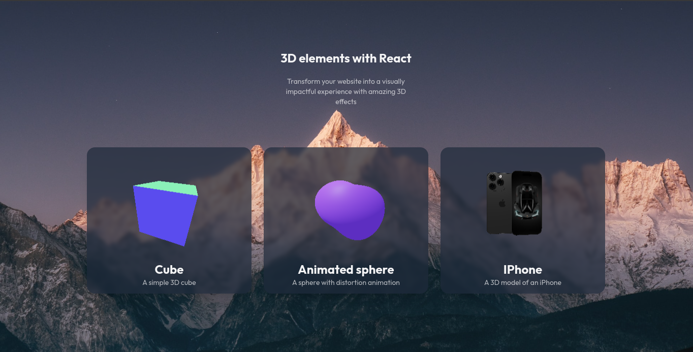

# 3D Website

This is a 3D website project created using Three.js, an open source JavaScript library that lets you create 3D animated graphics on the web. It was built with React and uses the Tailwind CSS style library.

## Technologies used

- @react-three/drei: library with components ready to be used with Three.js.
- @react-three/fiber: Library that provides a React wrapper for Three.js.
- @types/three: package containing type definitions for the Three.js library.
- react: JavaScript library for building user interfaces.
- react-dom: JavaScript library that provides rendering of React components in the DOM.
- three: JavaScript library for creating animated 3D graphics on the web.
- TailwindCSS

## How to install locally

1. Download the project to your computer or clone the repository using the following command:

```Shell
git clone https://github.com/Guilherme-Silva0/3d-website.git
```

2. Open the terminal in the project directory and run the following command to install the dependencies:

```Shell
npm install
```

3. Then run the following command to launch the application:

```Shell
npm run dev
```

4. The application will open in your browser at the address [http://localhost:5173](http://localhost:5173).

## Screenshot

- Home:
  

## License

This project is licensed under the MIT. For more information, see the LICENSE file.

## Final considerations

Hope you enjoyed this project! If you have any questions or suggestions, please feel free to get in touch.
